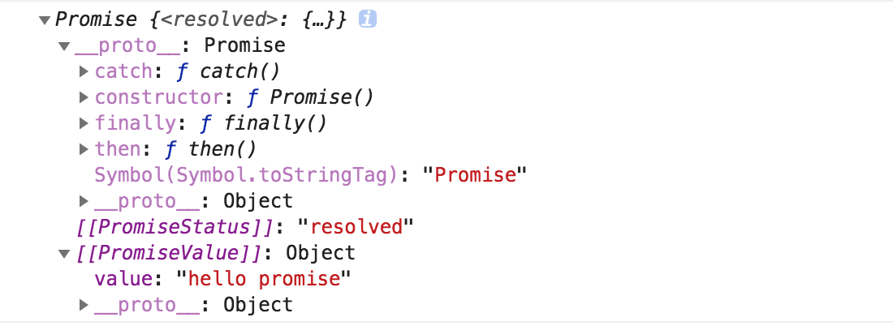

# promise 异步编程
`Promise` 是异步编程的一种解决方案。    

Promise是一个原生构造函数，通过new可生成promise实例。它接受一个函数作为参数，并且这个函数有`resolve`和`reject`两个参数。    
  
promise有三种状态，分别是`pending`(等待，未完成)、`resolved`(成功)、`rejected`(失败)。  

### 一，基本使用     
#####  promise实例
```js  
// promise实例
const promise = new Promise(function(resolve, reject) {
  // ...做一些事情
  if (/* 异步操作成功 */){
    resolve(value);
  } else {
    // 异步操作失败则reject
    reject(error);
  }
});  

```  
这个promise实例结构如下:  

  
#####  完整案例  
```js
const promise = new Promise((resolve, reject)=>{  

  // ...做一些事情  

  if (/* 异步操作成功 */){  

    resolve(value);
  } else {  

    // 异步操作失败则reject
    reject(error);
  }
});    

promise
  .then(
    value=>{ // resolve回调函数
       // 成功
    },
    error=>{ // reject回调函数
      // 失败
    }
  )
  .catch(error=>{
   // 异常捕获
  })
  .finally(()=>{  
    // 没有参数
   // 不管成功还是失败，都会执行。
  })
```
> finally是ES2018(es9)新增的promise实例方法  

### 二，promise实例方法   

#### then方法  
then()是promise的一个实例方法，它接受两个回调函数作为参数，第一个回调是当`pending=>resolved`时调用，表示成功，
第二个回调是当`pending=>rejected`时调用，表示失败。  

> then方法执行完会返回一个新的promise实例，因此它还可以接下一个then，下一个then...,可采用链式写法。

```js
const promise = new Promise((resolve, reject)=>{  
  // ...做一些事情  
  if (true){  
    resolve(1);
  } else {  
    reject(2);
  }
})    
// 第一个then，处理完后返回一个新的promise实例
.then(  
    // resolve回调函数
    value=>{ 
       console.log(value); // 1
       return 11;
    },  

    // reject回调函数
    error=>{ 
      console.log(error); // 2
      return getJSON(post.commentURL); // 返回一个promise实例给下一个then 
    }
)  
// 第二个then，处理上一个then返回的结果
.then(  
    // resolve回调函数
    value=>{ 
       console.log(value); // 11
    },  

    // 上一个then如果返回promise实例，并且是reject状态，则执行这个回调
    error=>{ 
      console.log(error); // 22
    }
)  
// 第三个then  
...
...
以此类推
```  
> 总之，error回调总是rejected的时候才会被调用，如果上一个then没有返回promise实例，或者返回的promise实例没有rejected，则不会调用。   

#### catch方法  

```js
getJSON('/posts.json')
 .then(posts=>{
   // ...
 })
 .then(value=>{
   // ...
 })
 .catch((error)=>{ 
   // 异常捕获
   // 处理 getJSON 和 前一个回调函数运行时发生的错误
   console.log('发生错误！', error);
 });
```  

#### finally方法

```js
fetch('/posts.json')  // 注意: 请求本地json文件时，这里的路径是相对于index.html的
 .then(value=>{
    // ...
 })
 .then(value=>{
   // ...
 })
 .catch(error=>{ 
   // 异常捕获
   // 处理 getJSON 和 前一个回调函数运行时发生的错误
   console.log('发生错误！', error);
 })
 .finally(()=>{
   // 最后执行
   // 不管成功失败都会执行
 })
```    

### 三，一些经典案例   

##### 1，使用promise封装ajax   
原生ajax并不支持promise，但我们可以用promise封装它。  
```js
const getJSON =( url )=>{    
    return new Promise(function(resolve, reject) {      
        const XHR = new XMLHttpRequest();   
        XHR.open('GET', url, true);        
        XHR.send();        
        XHR.onreadystatechange =()=>{           
        if (XHR.readyState == 4) {                
            if (XHR.status == 200) {                    
                try {                        
                    const response = JSON.parse(XHR.responseText);                        
                    resolve(response);                    
                } 
                catch (e) {                        
                        reject(e);                    
                }                
            } 
            else {                    
                reject(new Error(XHR.statusText));                
            }            
        }        
    }    
})}   

getJSON('./post.json')
 .then(data=>{
   // 拿到数据后，做一些处理
   if(data.code===200){
       console.log(data);
      // alert("请求成功");
   }else{
       alert(`请求失败:${data.msg}`);
   }
 })
 .catch(error=>{ 
   // 异常捕获
   // 处理 getJSON 和 前一个回调函数运行时发生的错误
   console.log('发生错误！', error);
 })
 .finally(()=>{
    console.log('请求处理结束');
   // 最后执行
   // 不管成功失败都会执行
 })
```


##### 2，使用fetch请求本地json文件  
fetch请求默认会返回一个promise。
```js
fetch('./post.json')  // 注意: 请求本地json文件时，这里的路径是相对于index.html的
 .then(response=>{
    // 解析json数据
    return response.json();
 })
 .then(data=>{
   // 拿到数据后，做一些处理
   if(data.code===200){
       console.log(data);
      // alert("请求成功");
   }else{
       alert(`请求失败:${data.msg}`);
   }
 })
 .catch(error=>{ 
   // 异常捕获
   // 处理 getJSON 和 前一个回调函数运行时发生的错误
   console.log('发生错误！', error);
 })
 .finally(()=>{
    console.log('请求处理结束');
   // 最后执行
   // 不管成功失败都会执行
 })
```

### 四，Promise.all([p1, p2, p3...])方法  
Promise.all方法用于将多个 Promise 实例，包装成一个全新的 Promise 实例，也就是包装实例。而传入的promise实例可以称之为内部实例。

> 1，只有内部实例全部处于fulfilled状态时，这个包装实例才会处于fulfilled状态。并且内部实例的返回值会组成一个数组返回给包装实例。   

> 2，当内部实例中有一个被rejected时，包装实例的状态也会变成rejected，并且这第一个被rejected的内部实例的返回值会传递给包装实例  

案例：
```js
// 生成一个Promise对象的数组
const promises = [2, 3, 5, 7, 11, 13].map(function (id) {
  return getJSON('/post/' + id + ".json");
});

Promise.all(promises).then(function (posts) {
  // 当所有内部实例fulfilled时执行
}).catch(function(reason){
  // 异常捕获
});
```  
> 注意：如果内部实例自定义了catch，则该内部实例抛出错误时不会再走包装实例的catch，而是走自定义的catch。