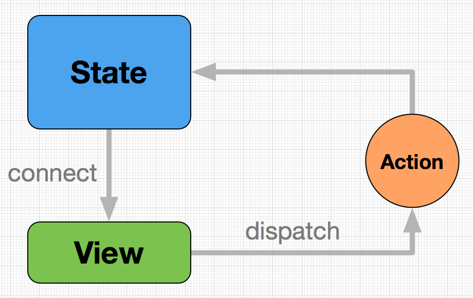

# react组件通信方式  
react组件之间往往需要进行通信，比如传递参数，传递数据等等。组件会发生以下三种通信:  
* 向子组件通信
* 向父组件通信
* 向其他组件通信

### 一，向子组件通信  
react是单向数据流，也就是自上而下传递数据。因此父组件可以通过props传递参数给子组件，下面是一个例子：
```js
// App是父组件，Header是子组件，App传递了user给子组件Header
const App = () =>{
    const { user } = props;
    return <div>
        <Header user={ user } />
    </div>
}

// 子组件Header，通过props获取到父组件传递过来的user
const Header = (props) =>{
    const { user } = props;
    return <div>
        { user && user.name }
    </div>
}
```

### 二，向父组件通信 
react子组件无法向父组件传递props，但我们可以通过一些特别的手段，来实现自下而上的反向数据流。

如何实现？ 我们可以从父组件传递一个callback(回调函数)给子组件，子组件调用这个callback并传递参数，从而实现子组件向父组件传递数据，也就是react的反向数据流。  

```js
// 父组件Form
class Form extends React.Component { 

    state = {
        inputValue: null
    }

    onEditor(inputValue){
        this.setState({ inputValue })
    }

    render(){
        return <div>
           <FormFiled onEditor = { this.onEditor.bind(this) }  />
        </div>
    }
}

// 子组件FormFiled
class FormFiled extends React.Component {

    render(){
        const { onEditor } = this.props;
        return <div>
           <input 
             type="text" 
             onChange = {e=>{
                 // 调用父组件的callback，并传递数据给父组件
                 onEditor(e.target.value);
             }}
           />
        </div>
    }
}
```

### 三，向其他组件通信

非从属关系组件通信不能直接传递数据，因此通常需要其他手段来实现通信。

##### 1，Context 数据共享
Context是react提供的一个API，用于帮助不同组件之间实现数据共享。  

Context 旨在共享全局数据，例如当前经过身份验证的用户，主题或首选语言等。 

> 注意： 请谨慎使用它，因为它使组件重用更加困难。


##### 2，第三方状态管理器 (redux、dva、mobx)
react允许使用第三方状态管理器来管理react组件的状态。他们是如何工作的呢 ？

以dva为例：    



> 上图中，`view`层是指react组件(视图层)，`state`层是指外部组件，通常存放在store状态库中，`Action`则是更新state的一些行为。  

> `connect`是一个方法，用于组件(view)连接store(状态库)，从而实现view和state同步更新。

> `dispatch`是用于更新state的一个方法。